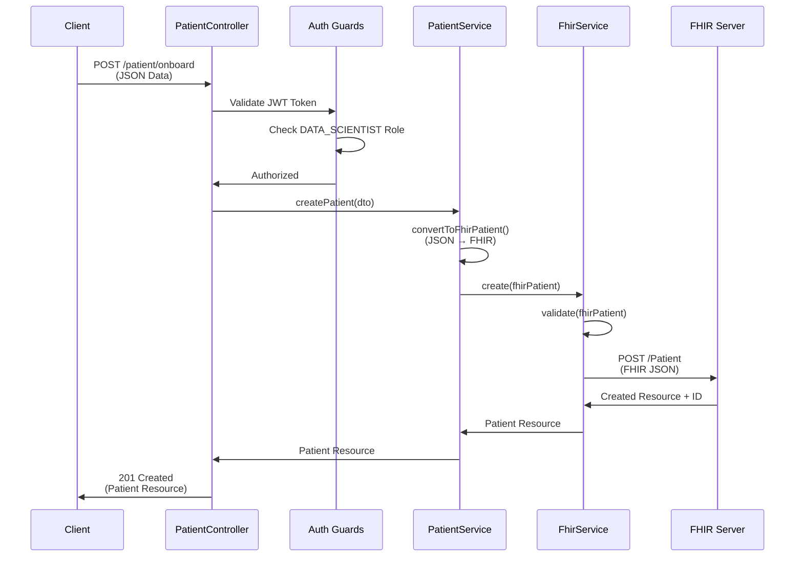
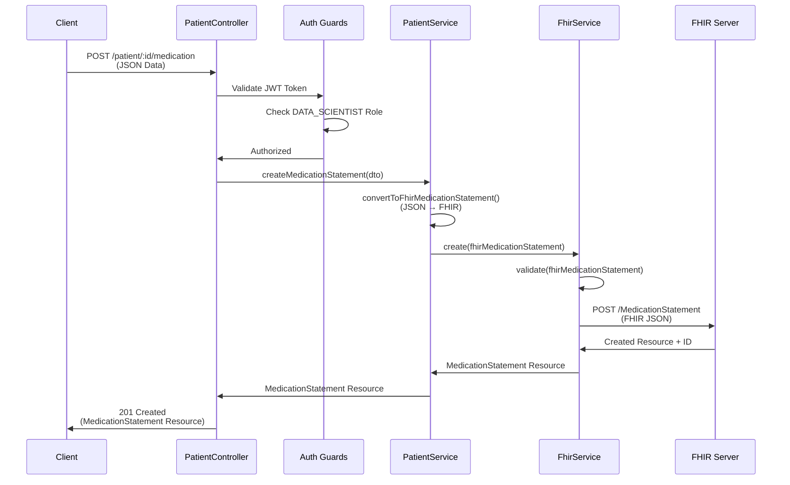

# FHIR Data Flow Diagram - Patient Onboarding & Medication Requests

## Table of Contents

1. [Overview](#overview)
2. [System Architecture](#system-architecture)
3. [Patient Onboarding Flow](#patient-onboarding-flow)
4. [Medication Request Flow](#medication-request-flow)
5. [Data Conversion Process](#data-conversion-process)
6. [FHIR Storage Process](#fhir-storage-process)
7. [Complete Flow Diagrams](#complete-flow-diagrams)

---

## Overview

This document explains the complete data flow for:

- **Patient Onboarding**: Converting patient JSON data to FHIR Patient resources
- **Medication Requests**: Creating MedicationStatement resources for patients
- **Background Processing**: JSON to FHIR conversion and storage in FHIR store

The system acts as a middleware layer that:

1. Receives business-friendly JSON data from clients
2. Converts it to FHIR R4 compliant resources
3. Validates the FHIR resources
4. Stores them in a local FHIR server

---

## System Architecture

```
┌─────────────────────────────────────────────────────────────────┐
│                         Client Application                        │
│                    (Sends JSON Data Format)                      │
└────────────────────────────┬────────────────────────────────────┘
                             │
                             │ HTTP Request (JSON)
                             │ Authorization: Bearer <JWT_TOKEN>
                             ▼
┌─────────────────────────────────────────────────────────────────┐
│                    NestJS API Layer                              │
│  ┌──────────────────────────────────────────────────────────┐   │
│  │  PatientController                                        │   │
│  │  - POST /patient/onboard                                  │   │
│  │  - POST /patient/:id/medication                          │   │
│  └──────────────┬───────────────────────────────────────────┘   │
│                 │                                                 │
│  ┌──────────────▼───────────────────────────────────────────┐   │
│  │  Guards Layer                                            │   │
│  │  - JwtAuthGuard: Validates JWT token                     │   │
│  │  - RolesGuard: Checks DATA_SCIENTIST role                │   │
│  └──────────────┬───────────────────────────────────────────┘   │
│                 │                                                 │
│  ┌──────────────▼───────────────────────────────────────────┐   │
│  │  PatientService                                          │   │
│  │  - convertToFhirPatient()                                │   │
│  │  - convertToFhirMedicationStatement()                   │   │
│  │  - createPatient()                                      │   │
│  │  - createMedicationStatement()                          │   │
│  └──────────────┬───────────────────────────────────────────┘   │
│                 │                                                 │
│  ┌──────────────▼───────────────────────────────────────────┐   │
│  │  FhirService (Global Module)                             │   │
│  │  - validate()                                            │   │
│  │  - create()                                              │   │
│  │  - read()                                                │   │
│  │  - search()                                              │   │
│  └──────────────┬───────────────────────────────────────────┘   │
└─────────────────┼─────────────────────────────────────────────────┘
                  │
                  │ HTTP POST/PUT/GET (FHIR JSON)
                  │ Content-Type: application/fhir+json
                  ▼
┌─────────────────────────────────────────────────────────────────┐
│                    Local FHIR Server                            │
│              (http://localhost:8080/fhir)                       │
│  ┌──────────────────────────────────────────────────────────┐   │
│  │  FHIR Store                                              │   │
│  │  - Patient Resources                                     │   │
│  │  - MedicationStatement Resources                         │   │
│  │  - Other FHIR Resources                                  │   │
│  └──────────────────────────────────────────────────────────┘   │
└─────────────────────────────────────────────────────────────────┘
```

---

## Patient Onboarding Flow

### High-Level Flow

```
┌─────────────────────────────────────────────────────────────────────┐
│ STEP 1: Client sends POST /patient/onboard                         │
│                                                                     │
│ Request Body (JSON):                                                │
│ {                                                                   │
│   "firstName": "John",                                              │
│   "lastName": "Doe",                                                │
│   "dateOfBirth": "1990-01-15",                                     │
│   "gender": "male",                                                 │
│   "email": "john.doe@example.com",                                 │
│   "phone": "1234567890",                                           │
│   "address": { ... },                                               │
│   "identifiers": [ ... ]                                            │
│ }                                                                   │
└────────────────────────────┬────────────────────────────────────────┘
                             │
                             ▼
┌─────────────────────────────────────────────────────────────────────┐
│ STEP 2: Authentication & Authorization                             │
│                                                                     │
│ ┌─────────────────┐      ┌─────────────────┐                      │
│ │  JwtAuthGuard   │ ───► │  RolesGuard     │                      │
│ │  Validates JWT  │      │  Checks Role    │                      │
│ │  Token          │      │  DATA_SCIENTIST │                      │
│ └─────────────────┘      └─────────────────┘                      │
└────────────────────────────┬────────────────────────────────────────┘
                             │
                             ▼
┌─────────────────────────────────────────────────────────────────────┐
│ STEP 3: PatientController.onboardPatient()                         │
│                                                                     │
│ - Receives CreatePatientDto                                         │
│ - Calls PatientService.createPatient()                             │
└────────────────────────────┬────────────────────────────────────────┘
                             │
                             ▼
┌─────────────────────────────────────────────────────────────────────┐
│ STEP 4: JSON to FHIR Conversion                                    │
│                                                                     │
│ PatientService.convertToFhirPatient()                              │
│                                                                     │
│ Input (JSON):                    Output (FHIR Patient):            │
│ {                                 {                                 │
│   firstName: "John"    ────────►  name: [{                         │
│   lastName: "Doe"                 │  family: "Doe",                │
│   dateOfBirth: "1990-01-15"       │  given: ["John"]               │
│   gender: "male"                  │ }],                            │
│   email: "john@..."               │ birthDate: "1990-01-15",       │
│   phone: "123..."                 │ gender: "male",                │
│   address: { ... }                │ telecom: [{                    │
│ }                                 │   system: "email",             │
│                                   │   value: "john@..."            │
│                                   │ }, {                           │
│                                   │   system: "phone",             │
│                                   │   value: "123..."              │
│                                   │ }],                            │
│                                   │ address: [{ ... }]             │
│                                   │ }                              │
└────────────────────────────┬────────────────────────────────────────┘
                             │
                             ▼
┌─────────────────────────────────────────────────────────────────────┐
│ STEP 5: FHIR Validation                                            │
│                                                                     │
│ FhirService.validate()                                              │
│                                                                     │
│ ┌──────────────────────────────────────────────────────────────┐  │
│ │  FHIR Client Library Validation                              │  │****
│ │  - Checks resource structure                                 │  │
│ │  - Validates required fields                                 │  │
│ │  - Ensures FHIR R4 compliance                                │  │
│ └──────────────────────────────────────────────────────────────┘  │
└────────────────────────────┬────────────────────────────────────────┘
                             │
                             │ Valid ✓
                             ▼
┌─────────────────────────────────────────────────────────────────────┐
│ STEP 6: Store in FHIR Server                                       │
│                                                                     │
│ FhirService.create()                                                │
│                                                                     │
│ POST http://localhost:8080/fhir/Patient                            │
│ Content-Type: application/fhir+json                                │
│                                                                     │
│ Body: FHIR Patient Resource (JSON)                                 │
└────────────────────────────┬────────────────────────────────────────┘
                             │
                             ▼
┌─────────────────────────────────────────────────────────────────────┐
│ STEP 7: Response                                                    │
│                                                                     │
│ Returns created Patient resource with assigned ID:                 │
│ {                                                                   │
│   "patient": {                                                      │
│     "resourceType": "Patient",                                     │
│     "id": "1",  ← Assigned by FHIR server                          │
│     "name": [...],                                                 │
│     ...                                                             │
│   }                                                                 │
│ }                                                                   │
└─────────────────────────────────────────────────────────────────────┘
```

### Detailed Conversion Mapping

| Input JSON Field       | FHIR Patient Path        | Conversion Logic                                  |
| ---------------------- | ------------------------ | ------------------------------------------------- |
| `firstName`            | `name[0].given[0]`       | First name goes to given array                    |
| `middleName`           | `name[0].given[1]`       | Middle name appended to given array (if provided) |
| `lastName`             | `name[0].family`         | Last name goes to family field                    |
| `dateOfBirth`          | `birthDate`              | Direct mapping (YYYY-MM-DD format)                |
| `gender`               | `gender`                 | Direct mapping (male/female/other/unknown)        |
| `email`                | `telecom[].value`        | Added to telecom array with `system: "email"`     |
| `phone`                | `telecom[].value`        | Added to telecom array with `system: "phone"`     |
| `address.street`       | `address[0].line[0]`     | Street goes to line array                         |
| `address.city`         | `address[0].city`        | Direct mapping                                    |
| `address.state`        | `address[0].state`       | Direct mapping                                    |
| `address.postalCode`   | `address[0].postalCode`  | Direct mapping                                    |
| `address.country`      | `address[0].country`     | Direct mapping                                    |
| `identifiers[].value`  | `identifier[].value`     | Direct mapping                                    |
| `identifiers[].system` | `identifier[].system`    | Direct mapping                                    |
| `identifiers[].type`   | `identifier[].type.text` | Wrapped in type object                            |

---

## Medication Request Flow

### High-Level Flow

```
┌─────────────────────────────────────────────────────────────────────┐
│ STEP 1: Client sends POST /patient/:id/medication                   │
│                                                                     │
│ Path Parameter: id = "1" (Patient ID)                               │
│                                                                     │
│ Request Body (JSON):                                                │
│ {                                                                   │
│   "medicationName": "Paracetamol",                                  │
│   "status": "active",                                               │
│   "dosage": {                                                       │
│     "quantityValue": "1",                                           │
│     "quantityUnit": "Tablet",                                       │
│     "frequency": "every 6 hours",                                   │
│     "asNeededReason": "for the pain"                               │
│   },                                                                │
│   "reason": "for the pain",                                         │
│   "startDate": "2024-01-15",                                       │
│   "endDate": "2024-01-20"                                           │
│ }                                                                   │
└────────────────────────────┬────────────────────────────────────────┘
                             │
                             ▼
┌─────────────────────────────────────────────────────────────────────┐
│ STEP 2: Authentication & Authorization                             │
│                                                                     │
│ ┌─────────────────┐      ┌─────────────────┐                      │
│ │  JwtAuthGuard   │ ───► │  RolesGuard     │                      │
│ │  Validates JWT  │      │  Checks Role    │                      │
│ │  Token          │      │  DATA_SCIENTIST │                      │
│ └─────────────────┘      └─────────────────┘                      │
└────────────────────────────┬────────────────────────────────────────┘
                             │
                             ▼
┌─────────────────────────────────────────────────────────────────────┐
│ STEP 3: PatientController.addMedicationStatement()                 │
│                                                                     │
│ - Extracts patient ID from URL path                                 │
│ - Sets patientId in DTO                                             │
│ - Calls PatientService.createMedicationStatement()                  │
└────────────────────────────┬────────────────────────────────────────┘
                             │
                             ▼
┌─────────────────────────────────────────────────────────────────────┐
│ STEP 4: JSON to FHIR Conversion                                    │
│                                                                     │
│ PatientService.convertToFhirMedicationStatement()                  │
│                                                                     │
│ Input (JSON):                    Output (FHIR MedicationStatement):│
│ {                                 {                                 │
│   patientId: "1"      ────────►  resourceType: "MedicationStatement",│
│   medicationName: "Paracetamol"   status: "active",                │
│   status: "active"                subject: {                       │
│   dosage: {                        │  reference: "Patient/1"        │
│     quantityValue: "1"             │ },                            │
│     quantityUnit: "Tablet"         │ medicationCodeableConcept: {  │
│     frequency: "every 6 hours"     │   text: "Paracetamol",        │
│     asNeededReason: "for pain"     │   coding: [...]                │
│   },                               │ },                            │
│   reason: "for the pain"           │ dosage: [{                     │
│   startDate: "2024-01-15"          │   doseAndRate: [{             │
│   endDate: "2024-01-20"            │     doseQuantity: {           │
│ }                                  │       value: 1,                │
│                                   │       unit: "Tablet"           │
│                                   │     }                           │
│                                   │   }],                           │
│                                   │   timing: {                     │
│                                   │     repeat: {                   │
│                                   │       frequency: 1,             │
│                                   │       period: 6,                │
│                                   │       periodUnit: "h"            │
│                                   │     }                           │
│                                   │   },                            │
│                                   │   asNeededBoolean: true         │
│                                   │ }],                             │
│                                   │ reasonCode: [{                  │
│                                   │   text: "for the pain"          │
│                                   │ }],                             │
│                                   │ effectivePeriod: {              │
│                                   │   start: "2024-01-15",          │
│                                   │   end: "2024-01-20"             │
│                                   │ }                               │
│                                   │ }                               │
└────────────────────────────┬────────────────────────────────────────┘
                             │
                             ▼
┌─────────────────────────────────────────────────────────────────────┐
│ STEP 5: FHIR Validation                                            │
│                                                                     │
│ FhirService.validate()                                              │
│                                                                     │
│ ┌──────────────────────────────────────────────────────────────┐  │
│ │  FHIR Client Library Validation                              │  │
│ │  - Validates MedicationStatement structure                   │  │
│ │  - Checks required fields (status, subject, medication)     │  │
│ │  - Ensures FHIR R4 compliance                                │  │
│ └──────────────────────────────────────────────────────────────┘  │
└────────────────────────────┬────────────────────────────────────────┘
                             │
                             │ Valid ✓
                             ▼
┌─────────────────────────────────────────────────────────────────────┐
│ STEP 6: Store in FHIR Server                                       │
│                                                                     │
│ FhirService.create()                                                │
│                                                                     │
│ POST http://localhost:8080/fhir/MedicationStatement                │
│ Content-Type: application/fhir+json                                │
│                                                                     │
│ Body: FHIR MedicationStatement Resource (JSON)                     │
└────────────────────────────┬────────────────────────────────────────┘
                             │
                             ▼
┌─────────────────────────────────────────────────────────────────────┐
│ STEP 7: Response                                                    │
│                                                                     │
│ Returns created MedicationStatement resource with assigned ID:     │
│ {                                                                   │
│   "medicationStatement": {                                         │
│     "resourceType": "MedicationStatement",                         │
│     "id": "2",  ← Assigned by FHIR server                          │
│     "status": "active",                                            │
│     "subject": { "reference": "Patient/1" },                       │
│     ...                                                             │
│   }                                                                 │
│ }                                                                   │
└─────────────────────────────────────────────────────────────────────┘
```

### Detailed Conversion Mapping

| Input JSON Field        | FHIR MedicationStatement Path                 | Conversion Logic                                                        |
| ----------------------- | --------------------------------------------- | ----------------------------------------------------------------------- |
| `patientId`             | `subject.reference`                           | Converted to `"Patient/{id}"` format                                    |
| `medicationName`        | `medicationCodeableConcept.text`              | Direct mapping                                                          |
| `medicationCode`        | `medicationCodeableConcept.coding[].code`     | Added to coding array (if provided)                                     |
| `medicationSystem`      | `medicationCodeableConcept.coding[].system`   | Added to coding array (if provided)                                     |
| `status`                | `status`                                      | Direct mapping (active/completed/etc.)                                  |
| `dosage.quantityValue`  | `dosage[0].doseAndRate[0].doseQuantity.value` | Parsed to number                                                        |
| `dosage.quantityUnit`   | `dosage[0].doseAndRate[0].doseQuantity.unit`  | Direct mapping                                                          |
| `dosage.frequency`      | `dosage[0].timing.repeat`                     | Parsed from string (e.g., "every 6 hours" → period: 6, periodUnit: "h") |
| `dosage.asNeededReason` | `dosage[0].asNeededBoolean` + `reasonCode`    | Sets asNeededBoolean: true and adds reason                              |
| `reason`                | `reasonCode[].text`                           | Added to reasonCode array                                               |
| `startDate`             | `effectivePeriod.start`                       | Direct mapping (date format)                                            |
| `endDate`               | `effectivePeriod.end`                         | Direct mapping (date format)                                            |

### Frequency Parsing Logic

The system intelligently parses frequency strings:

- `"every 6 hours"` → `{ frequency: 1, period: 6, periodUnit: "h" }`
- `"every 2 days"` → `{ frequency: 1, period: 2, periodUnit: "d" }`
- `"every 1 week"` → `{ frequency: 1, period: 1, periodUnit: "wk" }`
- Falls back to extracting number and assuming hours if pattern doesn't match

---

## Data Conversion Process

### Background Processing Steps

The conversion from JSON to FHIR happens in the background through the following steps:

```
┌─────────────────────────────────────────────────────────────────────┐
│                    JSON Input (Business Format)                     │
│                                                                     │
│  Simple, flat structure designed for easy client integration       │
└────────────────────────────┬────────────────────────────────────────┘
                             │
                             ▼
┌─────────────────────────────────────────────────────────────────────┐
│ STEP 1: DTO Validation                                              │
│                                                                     │
│ - Class-validator decorators validate input                         │
│ - Type checking and format validation                               │
│ - Required field checks                                             │
└────────────────────────────┬────────────────────────────────────────┘
                             │
                             ▼
┌─────────────────────────────────────────────────────────────────────┐
│ STEP 2: Conversion Method Called                                    │
│                                                                     │
│ PatientService.convertToFhirPatient()                               │
│ OR                                                                  │
│ PatientService.convertToFhirMedicationStatement()                   │
└────────────────────────────┬────────────────────────────────────────┘
                             │
                             ▼
┌─────────────────────────────────────────────────────────────────────┐
│ STEP 3: Field-by-Field Mapping                                      │
│                                                                     │
│ ┌──────────────────────────────────────────────────────────────┐   │
│ │  For each field in input JSON:                              │   │
│ │  1. Extract value                                           │   │
│ │  2. Apply transformation rules                              │   │
│ │  3. Map to FHIR structure                                   │   │
│ │  4. Handle nested objects/arrays                             │   │
│ └──────────────────────────────────────────────────────────────┘   │
└────────────────────────────┬────────────────────────────────────────┘
                             │
                             ▼
┌─────────────────────────────────────────────────────────────────────┐
│ STEP 4: FHIR Resource Construction                                  │
│                                                                     │
│ - Build FHIR resource object                                        │
│ - Set resourceType                                                 │
│ - Add all mapped fields                                             │
│ - Ensure proper nesting and structure                               │
└────────────────────────────┬────────────────────────────────────────┘
                             │
                             ▼
┌─────────────────────────────────────────────────────────────────────┐
│                    FHIR Resource (R4 Compliant)                     │
│                                                                     │
│  Structured according to FHIR R4 specification                     │
│  Ready for validation and storage                                   │
└─────────────────────────────────────────────────────────────────────┘
```

### Example: Patient Conversion

**Input JSON:**

```json
{
  "firstName": "John",
  "lastName": "Doe",
  "middleName": "Michael",
  "dateOfBirth": "1990-01-15",
  "gender": "male",
  "email": "john.doe@example.com",
  "phone": "1234567890",
  "address": {
    "street": "123 Main St",
    "city": "New York",
    "state": "NY",
    "postalCode": "10001",
    "country": "USA"
  },
  "identifiers": [
    {
      "value": "MRN12345",
      "type": "Medical Record Number",
      "system": "http://hospital.smarthealthit.org"
    }
  ]
}
```

**Output FHIR Patient Resource:**

```json
{
  "resourceType": "Patient",
  "name": [
    {
      "family": "Doe",
      "given": ["John", "Michael"]
    }
  ],
  "birthDate": "1990-01-15",
  "gender": "male",
  "telecom": [
    {
      "system": "email",
      "value": "john.doe@example.com"
    },
    {
      "system": "phone",
      "value": "1234567890"
    }
  ],
  "address": [
    {
      "line": ["123 Main St"],
      "city": "New York",
      "state": "NY",
      "postalCode": "10001",
      "country": "USA"
    }
  ],
  "identifier": [
    {
      "value": "MRN12345",
      "system": "http://hospital.smarthealthit.org",
      "type": {
        "text": "Medical Record Number"
      }
    }
  ]
}
```

### Example: MedicationStatement Conversion

**Input JSON:**

```json
{
  "patientId": "1",
  "medicationName": "Paracetamol",
  "medicationCode": "161",
  "medicationSystem": "http://www.nlm.nih.gov/research/umls/rxnorm",
  "status": "active",
  "dosage": {
    "quantityValue": "1",
    "quantityUnit": "Tablet",
    "frequency": "every 6 hours",
    "asNeededReason": "for the pain"
  },
  "reason": "for the pain",
  "startDate": "2024-01-15",
  "endDate": "2024-01-20"
}
```

**Output FHIR MedicationStatement Resource:**

```json
{
  "resourceType": "MedicationStatement",
  "status": "active",
  "subject": {
    "reference": "Patient/1"
  },
  "medicationCodeableConcept": {
    "text": "Paracetamol",
    "coding": [
      {
        "system": "http://www.nlm.nih.gov/research/umls/rxnorm",
        "code": "161",
        "display": "Paracetamol"
      }
    ]
  },
  "dosage": [
    {
      "doseAndRate": [
        {
          "doseQuantity": {
            "value": 1,
            "unit": "Tablet"
          }
        }
      ],
      "timing": {
        "repeat": {
          "frequency": 1,
          "period": 6,
          "periodUnit": "h"
        }
      },
      "asNeededBoolean": true
    }
  ],
  "reasonCode": [
    {
      "text": "for the pain"
    }
  ],
  "effectivePeriod": {
    "start": "2024-01-15",
    "end": "2024-01-20"
  }
}
```

---

## FHIR Storage Process

### Storage Flow

```
┌─────────────────────────────────────────────────────────────────────┐
│                    FHIR Resource (Validated)                        │
└────────────────────────────┬────────────────────────────────────────┘
                             │
                             ▼
┌─────────────────────────────────────────────────────────────────────┐
│ STEP 1: HTTP Request Preparation                                    │
│                                                                     │
│ FhirService.create()                                                │
│                                                                     │
│ - Constructs HTTP POST request                                      │
│ - Sets Content-Type: application/fhir+json                          │
│ - Sets Accept: application/fhir+json                                │
│ - Target URL: {FHIR_BASE_URL}/{resourceType}                       │
│   Example: http://localhost:8080/fhir/Patient                      │
└────────────────────────────┬────────────────────────────────────────┘
                             │
                             ▼
┌─────────────────────────────────────────────────────────────────────┐
│ STEP 2: Send to FHIR Server                                        │
│                                                                     │
│ POST http://localhost:8080/fhir/Patient                            │
│ Headers:                                                            │
│   Content-Type: application/fhir+json                               │
│   Accept: application/fhir+json                                     │
│                                                                     │
│ Body: FHIR Resource JSON                                            │
└────────────────────────────┬────────────────────────────────────────┘
                             │
                             ▼
┌─────────────────────────────────────────────────────────────────────┐
│ STEP 3: FHIR Server Processing                                     │
│                                                                     │
│ ┌──────────────────────────────────────────────────────────────┐   │
│ │  1. Receives FHIR resource                                   │   │
│ │  2. Validates resource structure                             │   │
│ │  3. Assigns unique resource ID                               │   │
│ │  4. Stores in FHIR database                                  │   │
│ │  5. Returns created resource with ID                         │   │
│ └──────────────────────────────────────────────────────────────┘   │
└────────────────────────────┬────────────────────────────────────────┘
                             │
                             ▼
┌─────────────────────────────────────────────────────────────────────┐
│ STEP 4: Response Handling                                           │
│                                                                     │
│ - Receives created resource with assigned ID                       │
│ - Logs success message                                              │
│ - Returns resource to calling service                               │
└────────────────────────────┬────────────────────────────────────────┘
                             │
                             ▼
┌─────────────────────────────────────────────────────────────────────┐
│ STEP 5: Resource Stored in FHIR Store                              │
│                                                                     │
│ The resource is now:                                                │
│ - Persisted in FHIR database                                        │
│ - Accessible via FHIR REST API                                     │
│ - Can be retrieved, updated, or searched                            │
│ - Linked to other resources (e.g., MedicationStatement → Patient)  │
└─────────────────────────────────────────────────────────────────────┘
```

### Resource Relationships

After storage, resources are linked:

```
┌─────────────────────────────────────────────────────────────────────┐
│                        FHIR Store                                    │
│                                                                     │
│  ┌──────────────────┐                                              │
│  │  Patient/1       │                                              │
│  │  - Name: John Doe│                                              │
│  │  - DOB: 1990-01-15│                                             │
│  └────────┬─────────┘                                              │
│           │                                                         │
│           │ referenced by                                          │
│           │                                                         │
│  ┌────────▼──────────────────┐                                     │
│  │  MedicationStatement/2     │                                     │
│  │  - Medication: Paracetamol│                                     │
│  │  - Status: active          │                                     │
│  │  - Subject: Patient/1      │◄─────── Reference                  │
│  └────────────────────────────┘                                     │
│                                                                     │
│  ┌──────────────────┐                                              │
│  │  MedicationStatement/3     │                                     │
│  │  - Medication: Aspirin     │                                     │
│  │  - Status: active          │                                     │
│  │  - Subject: Patient/1      │◄─────── Reference                  │
│  └────────────────────────────┘                                     │
└─────────────────────────────────────────────────────────────────────┘
```

---

## Complete Flow Diagrams

### Mermaid Diagram (Patient Onboarding)



### Mermaid Diagram (Medication Request)



### ASCII Flow Diagram (Complete Process)

```
┌─────────────────────────────────────────────────────────────────────────────┐
│                          COMPLETE DATA FLOW                                  │
└─────────────────────────────────────────────────────────────────────────────┘

┌──────────────┐
│   CLIENT     │
│  (JSON Data) │
└──────┬───────┘
       │
       │ 1. POST /patient/onboard
       │    { firstName, lastName, ... }
       ▼
┌──────────────────────────────────────────────────────────────────────────┐
│                         NESTJS API LAYER                                  │
│                                                                           │
│  ┌────────────────────────────────────────────────────────────────────┐ │
│  │  PatientController                                                  │ │
│  │  - Receives CreatePatientDto                                        │ │
│  └────────────────────┬───────────────────────────────────────────────┘ │
│                       │                                                   │
│  ┌────────────────────▼───────────────────────────────────────────────┐ │
│  │  Guards (JwtAuthGuard + RolesGuard)                                │ │
│  │  - Validates authentication                                         │ │
│  │  - Checks authorization (DATA_SCIENTIST role)                       │ │
│  └────────────────────┬───────────────────────────────────────────────┘ │
│                       │                                                   │
│  ┌────────────────────▼───────────────────────────────────────────────┐ │
│  │  PatientService                                                     │ │
│  │                                                                     │ │
│  │  convertToFhirPatient():                                           │ │
│  │  ┌──────────────────────────────────────────────────────────────┐  │ │
│  │  │  JSON → FHIR Conversion                                       │  │ │
│  │  │                                                               │  │ │
│  │  │  Input:  { firstName: "John", lastName: "Doe" }             │  │ │
│  │  │  Output: { name: [{ family: "Doe", given: ["John"] }] }     │  │ │
│  │  └──────────────────────────────────────────────────────────────┘  │ │
│  └────────────────────┬───────────────────────────────────────────────┘ │
│                       │                                                   │
│  ┌────────────────────▼───────────────────────────────────────────────┐ │
│  │  FhirService                                                        │ │
│  │                                                                     │ │
│  │  validate():                                                       │ │
│  │  ┌──────────────────────────────────────────────────────────────┐  │ │
│  │  │  - Validates FHIR structure                                  │  │ │
│  │  │  - Checks required fields                                     │  │ │
│  │  │  - Ensures R4 compliance                                     │  │ │
│  │  └──────────────────────────────────────────────────────────────┘  │ │
│  │                                                                     │ │
│  │  create():                                                         │ │
│  │  ┌──────────────────────────────────────────────────────────────┐  │ │
│  │  │  POST http://localhost:8080/fhir/Patient                     │  │ │
│  │  │  Content-Type: application/fhir+json                         │  │ │
│  │  │  Body: FHIR Patient Resource                                │  │ │
│  │  └──────────────────────────────────────────────────────────────┘  │ │
│  └────────────────────┬───────────────────────────────────────────────┘ │
└───────────────────────┼───────────────────────────────────────────────────┘
                        │
                        │ HTTP POST (FHIR JSON)
                        ▼
┌──────────────────────────────────────────────────────────────────────────┐
│                        FHIR SERVER                                        │
│                   (http://localhost:8080/fhir)                           │
│                                                                           │
│  ┌────────────────────────────────────────────────────────────────────┐ │
│  │  1. Receives FHIR Resource                                         │ │
│  │  2. Validates structure                                            │ │
│  │  3. Assigns ID (e.g., "1")                                         │ │
│  │  4. Stores in database                                             │ │
│  │  5. Returns created resource                                       │ │
│  └────────────────────────────────────────────────────────────────────┘ │
│                                                                           │
│  ┌────────────────────────────────────────────────────────────────────┐ │
│  │  FHIR Store (Database)                                             │ │
│  │                                                                     │ │
│  │  Patient/1                                                         │ │
│  │  MedicationStatement/2 (references Patient/1)                     │ │
│  │  MedicationStatement/3 (references Patient/1)                      │ │
│  │  ...                                                               │ │
│  └────────────────────────────────────────────────────────────────────┘ │
└──────────────────────────────────────────────────────────────────────────┘
                        │
                        │ Response (FHIR Resource + ID)
                        ▼
┌──────────────────────────────────────────────────────────────────────────┐
│                         RESPONSE TO CLIENT                                │
│                                                                           │
│  {                                                                        │
│    "patient": {                                                          │
│      "resourceType": "Patient",                                         │
│      "id": "1",                                                          │
│      "name": [{ "family": "Doe", "given": ["John"] }],                  │
│      ...                                                                 │
│    }                                                                      │
│  }                                                                        │
└──────────────────────────────────────────────────────────────────────────┘
```

---

## Key Points for Clients

### 1. **Simplified Input Format**

- Clients send simple, business-friendly JSON
- No need to understand FHIR structure
- Flat, intuitive field names

### 2. **Automatic Conversion**

- System automatically converts JSON to FHIR format
- Handles complex nested structures
- Ensures FHIR R4 compliance

### 3. **Validation**

- Input validation (DTO level)
- FHIR structure validation
- Ensures data quality before storage

### 4. **FHIR Storage**

- Resources stored in standard FHIR format
- Accessible via FHIR REST API
- Can be queried, updated, and linked

### 5. **Resource Linking**

- MedicationStatements automatically link to Patients
- References maintained in FHIR format
- Enables complex queries and relationships

### 6. **Error Handling**

- Validation errors returned before storage
- FHIR server errors properly handled
- Clear error messages for debugging

---

## Summary

The system provides a **seamless bridge** between:

- **Client applications** (using simple JSON)
- **FHIR-compliant storage** (using FHIR R4 resources)

**Key Benefits:**

1. ✅ Easy integration for clients (simple JSON)
2. ✅ FHIR compliance (standard healthcare format)
3. ✅ Automatic conversion (no manual mapping)
4. ✅ Validation at multiple levels (data quality)
5. ✅ Standard FHIR storage (interoperability)

The conversion happens **transparently in the background**, allowing clients to work with familiar JSON structures while the system handles all FHIR complexity.
